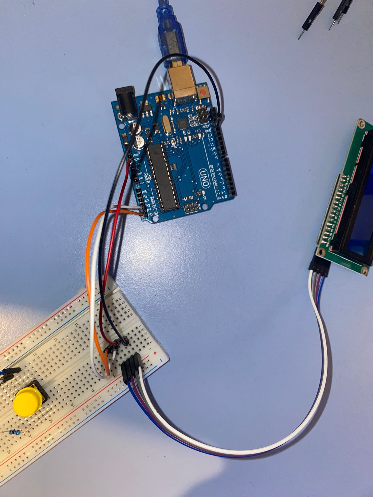
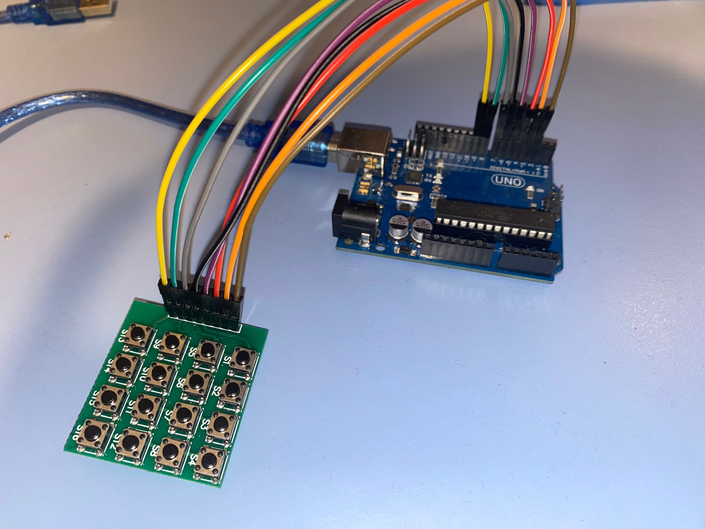
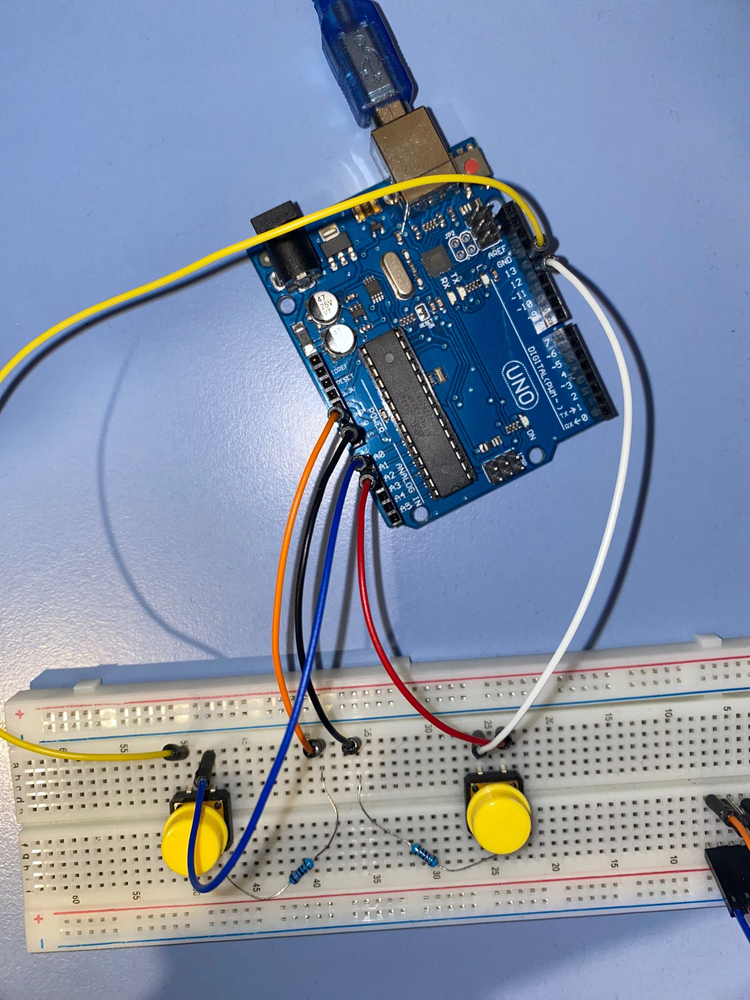

# Arduino 4 bar Drum pattern

## Part of an unnamed group of projects consisting of different apps that interact with Arduino components

## Table of contents
1. [Description](#description)
2. [Prerequisites](#prerequisites)
3. [Setup](#setup)
4. [Connections](#connections)
5. [Adding and changing sounds](#sounds)


## Description <a name = "description"></a>
4 Bar Drum Pattern Manager, Beat-Maker, similar to the FL Studio Channel Rec interface, but with arduino components
By pressing on a 4x4 button grid, you can select the beats on which a specific drum sound will play,
and then you can switch the sound or print out the entire pattern


## All the needed components for this group of projects can be found in the Arduino Uno R3 KIT with 24 components <a name = "prerequisites"></a>
### Required:
- Arduino Uno
- 2 Tact Buttons
- 4x4 Button Grid
- LCD 1602


**Lines that will be modified should you want to change sounds or add more sounds**
> script.py
```
# VARIABLES TO BE CHANGED
numberOfSounds = 5
List = [kick, hihat, clap, snare, openhat]
names = ["KICK", "HIHAT", "CLAP", "SNARE", "OPENHAT"]
```

> soundpad.ino
```
// CHANGE IF MORE SOUNDS ADDED
const int nrOfSounds = 5;
char sounds[20][20] = {"KICK", "HIHAT", "CLAP", "SNARE", "OPENHAT"};
```

Here you might need to change the lcd serial in the .ino or port in python
```
// I2C INITIALISATION
LiquidCrystal_I2C lcd(0x27, 16, 2);
```


## Setup <a name = "setup"></a>
- the Arduino is provided the .ino, then it returns messages through the COM3 port (in my case) and the .py reads it and plays sounds
- you upload the .ino into the arduino, then close the arduino IDE and you don't have to do anything with it unless you want to add new sounds
- with the .py, you use the sounds you like (or the ones I used for a test), change the paths if needed
- with Arduino IDE closed and the Arduino Uno plugged in, run the .py and jam on the grid!


## Connecting the components <a name = "connections"></a>

### Connecting the LCD


The LCD is 16x2, and has a 8051 microcontroller on its back
| LCD | Arduino |
| --- | ------- |
| GND | GND |
| VCC | 5V |
| SDA | A4 |
| SCL | A5 |


### Connecting the 4x4 keypad matrix


The connections can be seen clearly in the image.


### Connecting the 2 switches that control the current sound and when to print the pattern


How the connections are made can also be observed in this pard of the *soundpad.ino* script
```
#define changeSoundInput A0
#define printBeatInput A1
#define changeSoundOutput 13
#define printBeatOutput 12
```

*B1* - button on the left, that switches the sound
*B2* - button on the right, that prints the pattern of the beat

Each one of them has a pull down resistor connected to the ground
*B1* gets its input from *A0* and its output goes to *13*
*B2* gets its input from *A1* and its output goes to *12*

## Adding and changing sounds <a name = "sounds"></a>
- all you need to do is change things in the parts of the code, both in the .ino and in the .py, that are preceded by messages saying that those are changeable parts
- when adding a new sound in .py, you need to write <yoursound> = pygame.mixer.Sound(r'<PATH>'), and then add <yoursound> to the List, and its name in caps to names
- change numberOfSounds (.py) and nrOfSounds (.ino) if needed
- the names list from the .py must be exactly the same as the sounds[20][20] from the .ino
- remember to add the correct paths to the .py


# That's about it. Have fun and feel free to criticize and offer feedback!
